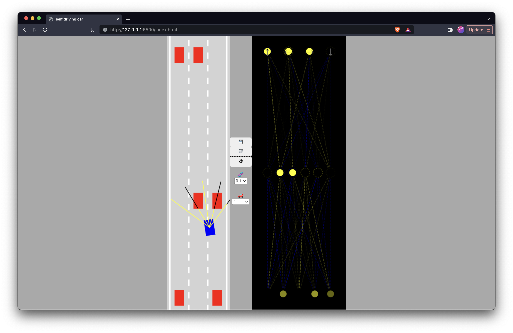

# Self Driving Car in Javascript

[Live website](https://kailashganesh.github.io/Self-driving-car-JS/)

### ScreenShot 



### The Goal

### Built with

- HTML5 Canvas
- CSS custom properties
- Javascript
- No libraries where used

### What I learned

- Making smaller and simpler implementations and making them  more useful and bigger as you go on, to ensure you aren't stuck in just one step; seeing things as slow burns instead of a heavy lift

- the way the controls are made in the game, I could't think of how to make the car turn left or right only while going forward, the way the guide did it, I thought was ingenious + using sin and cos to do the rotation

```js
// only turns when there is some speed - car can't turn in place
if(this.speed != 0){
    // are we going forwards or backwards?
    const flip = this.speed>0? 1:-1;

    // if going backward and pressing right, the car will move right since we have fixed the signs
    if(this.controls.left){
        this.angle += 0.03*flip;
    }
    if(this.controls.right){
        this.angle -= 0.03*flip;
    }
}


this.x -= Math.sin(this.angle)*this.speed;
this.y -= Math.cos(this.angle)*this.speed;
```


### Continued development

Use this section to outline areas that you want to continue focusing on in future projects. These could be concepts you're still not completely comfortable with or techniques you found useful that you want to refine and perfect.

### Reference
- Inspration and main guide: [Self-driving car with Javascript Course on youtube](https://www.youtube.com/watch?v=Rs_rAxEsAvI)